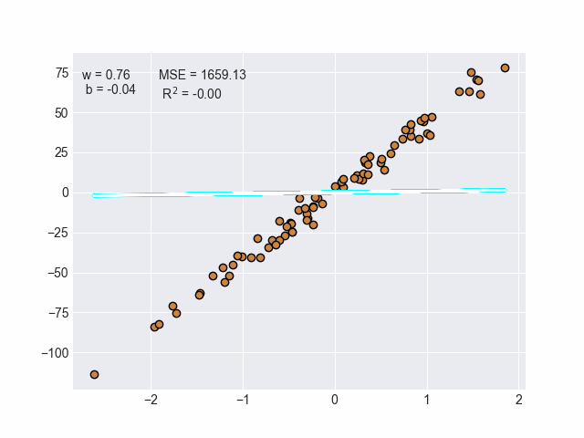

# RegGPT

A machine learning model that automatically fits the best regression line to any given dataset whose entries are of the form `(x, y)`. Only quantitative data works (no variable encoding yet) compatible with linear, logistic and polynomial regression.

## Showcase

Using the [sklearn](https://scikit-learn.org/stable/) we can create a linear regression data set. The `LinearRegression` class handles the training.

<p align = "center">
  
</p>

Not all data is linear. As such the `PolynomialRegression` is used to update the weights and biases according to non-linear data. Note that you can test the accuracy of this model by inputting the `degree` parameter in either the `train_pol_reg()` or `plot_pol_reg()` function.

<p align = "center">
  
</p>

## Dependencies

The build for this program can be entirely done by running one of the scripting files suitable for your operating system and terminal of choice. If you are using the Windows CMD terminal then run the `.\build.bat` file while running the `.\build.ps1` file for Windows powershell. For any WLS or Linux based terminal system run the following command,

```bash
source scripts/build.sh
```

If you are unable to run the above command due any permission issues then run the command `chmod +x ./scripts/build.sh` to give the `build.sh` file the necessary permissions to be executed.

### API KEYS

To use your own [OpenAi](https://platform.openai.com/overview) API key run the following command while in the root directory of the project.

```bash
python3 source/api_key.py --openai <your_api_key>
```

As of June 13, 2023, the API key does not work for using any GPT-4 model (none will be called anyway). In the future make sure that you have the necessary permissions to run the GPT-4 model.
