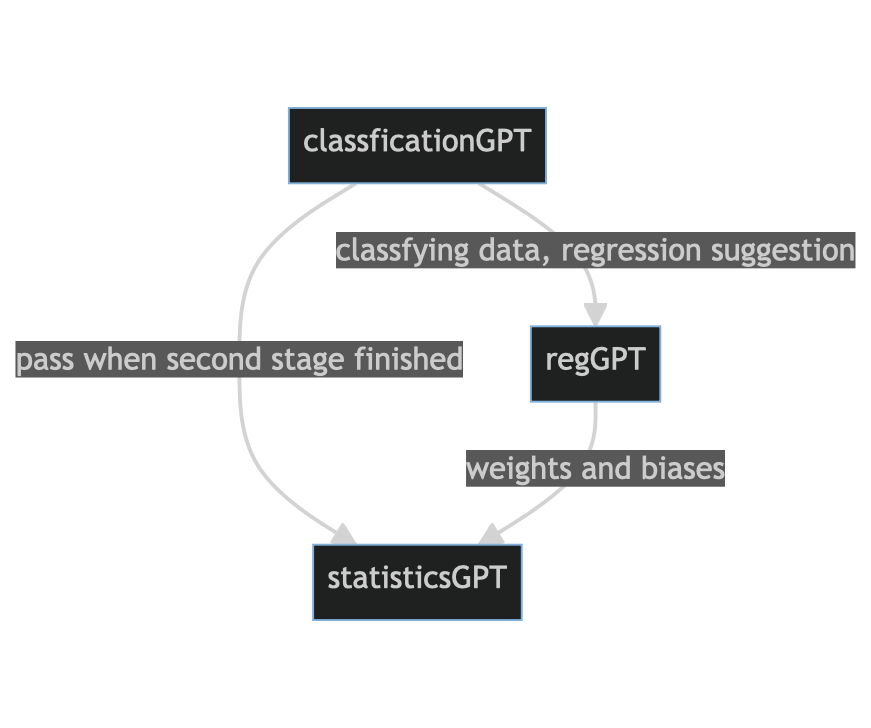
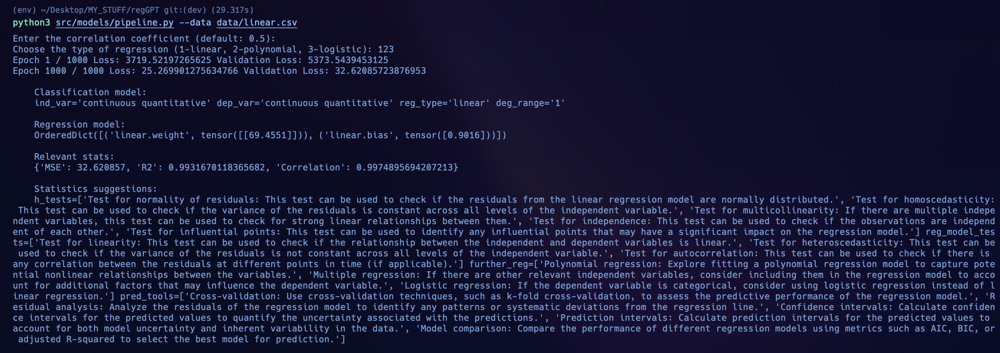

# Project Design

So far we have the following features.
1. `classificationGPT` classifies the data input dependent and independent variables into quantitative/qualitative variable (and subtypes)
2. `regGPT` the main agent that trains and updates the weights and bias of a linear, polynomial or logistic regression line (soon we should have compatibility with multi linear regression)
3. `statisticsGPT` this outputs further testing that would be helpful given our past agents outputs

Here is the main idea that I think would benefit the community.

### Features

Let's quickly talk about the model pipeline.

Essentially the first model `classificationGPT` outputs two relevant things,
1. The classification of the data input 
2. The regression type suggestion

The regression suggestion (as well as the degree if polynomial) is passed into the `regGPT` model which is then trained on the csv data (splitting the data in training and validation data sets).

Finally, the output from both of these models are passed to the last model which outputs the best hypothesis tests and further regression analysis to be conducted.

**Improvement:** Here is an example of the final output,

As you can see there are a lot of suggestions. Based on the current information of the model, we should score each of them according to relevance and amount of useful information each output suggestions provides on some quantifiable scale. 

**Future Features:** The following is a list of features that would be eye-catching to the user and on top of that, gives them a lot of flexibility.
- *Data visualization:* Ability to visualize the input data, regression line, and residuals. Use an existing python library.
- *Feature importance:* Implementation quantifying the importance of each feature in the regression model. Gives the user the insight on the features most influential in their model.
- *Model comparison:* Allowing users to compare different regression models then the initial model trained on `regGPT` based on the suggestion of `classificationGPT`
- *Cross-validation:* Providing the user with a more robust measure of the model's performance. This will allow the user to prevent overfitting and have more confidence in their model
- *Interactive UI:* This one is super important because the way the UI/UX is designed will bring all the features to life.
- *Automated preprocessing:* Allow features like handling missing values, outlier detecting and feature scaling.
- *Advanced techniques:* Implementation of partial dependence plots or SHAP values.
- *Prediction intervals:* Have point and interval predictions which quantify the uncertainty of the prediction.
- *Time series data:* Give the user the ability to use time series data and techniques such as ARIMA or LSTM models.
- *Documentation:* Apart from just the `README.md` there should be strong documentation on how to use the entire agent itself.

All in all the paper should be about the logistic on piecing all of these features together. It would be really attractive to do some data analysis on the performance of the model, comparing the model itself against let's say a data analyst with years of experience.
